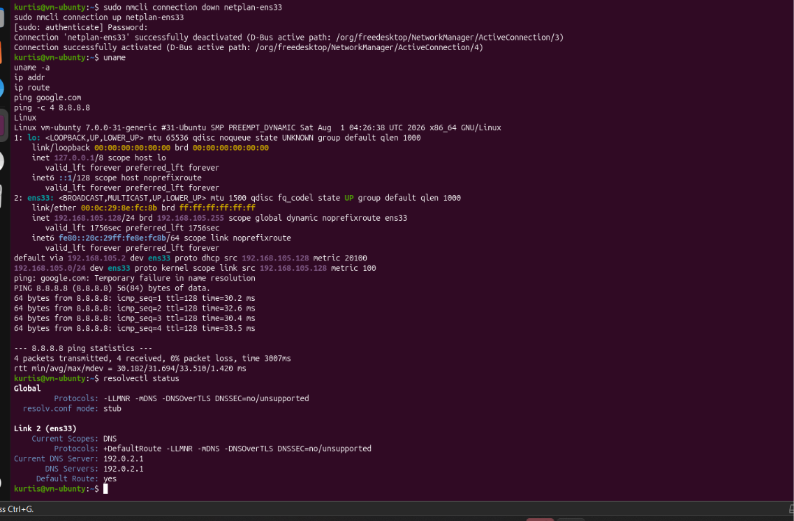

# INC-001: DNS Resolution Failure

## Incident Summary

A user reported that their Ubuntu workstation appeared connected to the network but was unable to access resources by hostname. Initial testing confirmed that the workstation had a valid IP address, an active default route, and successful connectivity to external IP addresses, while DNS name resolution failed. Further investigation identified an incorrect manually configured DNS server that prevented the system from resolving hostnames. The incorrect DNS configuration was removed, automatic DNS configuration was restored, and connectivity was successfully verified.

## Lab Environment

| Component | Configuration |
|---|---|
| Host Operating System | Windows 11 Home |
| Hypervisor | VMware Workstation Pro |
| Virtual Machine | `vm001` |
| Guest Operating System | Ubuntu Desktop |
| VM Memory | 5 GB RAM |
| Virtual Disk | 40 GB |
| Network Adapter | VMware NAT |
| Linux Network Interface | `ens33` |
| Network Management | NetworkManager / Netplan |
| IPv4 Assignment | DHCP |
| VM IPv4 Address | `192.168.105.128/24` |
| Default Gateway | `192.168.105.2` |
| Known-Good DNS Server | `192.168.105.2` |

The incident was performed in an isolated virtualized lab environment. The Ubuntu workstation was configured to use VMware NAT networking, allowing the guest system to access external networks through the host while maintaining separation from the physical network. Prior to troubleshooting, the workstation had a functional DHCP-assigned IPv4 configuration and confirmed external network connectivity.

## Reported Symptoms

The user reported that their Ubuntu workstation appeared to be connected to the network, but websites and other resources requiring hostname resolution were inaccessible. The network connection indicator showed an active connection, and no similar connectivity issues were reported by other users.

From the user's perspective, the workstation appeared to have lost internet access despite remaining connected to the network.

## Initial Investigation

Troubleshooting began by verifying the workstation's current network configuration before making any changes.

The `ip addr` command confirmed that the `ens33` network interface was active and had been assigned the IPv4 address `192.168.105.128/24`.

The `ip route` command confirmed that the workstation had an active default route through the gateway `192.168.105.2`. The route was identified as `proto dhcp`, indicating that the routing information had been obtained through DHCP.

With the local network configuration appearing valid, connectivity was tested using both a hostname and a direct external IP address.

```bash
ping google.com
```

The hostname test failed with:

```text
Temporary failure in name resolution
```

External IP connectivity was then tested independently of DNS:

```bash
ping -c 4 8.8.8.8
```

The test completed successfully with four responses and 0% packet loss.

These results demonstrated that the workstation retained external IP connectivity but was unable to resolve hostnames. This significantly narrowed the suspected fault domain from general network connectivity to DNS name resolution.
### Evidence: Initial Network and DNS Diagnostics



*Figure 1 — Initial diagnostics confirmed functional IPv4 addressing and routing, successful external connectivity to `8.8.8.8`, and failed hostname resolution. Resolver inspection identified `192.0.2.1` as the active DNS server.*

## Troubleshooting Process

### Inspecting DNS Configuration

After confirming that external IP connectivity was functional while hostname resolution was failing, the next step was to inspect the workstation's active DNS configuration.

```bash
resolvectl status
```

The output showed that the `ens33` interface was configured to use the following DNS server:

```text
Current DNS Server: 192.0.2.1
DNS Servers: 192.0.2.1
```

This identified `192.0.2.1` as the active resolver being used by the workstation. Because the system could reach external IP addresses but could not resolve hostnames, the configured DNS server became the primary suspected cause of the incident.

### Testing the Suspected DNS Server

Connectivity to the configured DNS server was tested directly:

```bash
ping -c 4 192.0.2.1
```

The test resulted in 100% packet loss.

A failed ICMP test alone does not conclusively prove that a DNS service is unavailable because a host may be configured to ignore ICMP traffic. However, when combined with the successful external IP connectivity, failed hostname resolution, and active resolver configuration, the results provided additional evidence supporting the DNS configuration as the likely fault domain.

### Determining the Root Cause

The investigation determined that the workstation's NetworkManager connection profile contained an incorrect manually configured DNS server. The connection was also configured to ignore automatically supplied DNS settings.

As a result, the workstation retained a valid DHCP-assigned IPv4 address and functional routing but attempted to send DNS queries to the incorrect resolver. This allowed communication with external resources by IP address while preventing hostname resolution.

## Root Cause

The root cause was an incorrect manual DNS configuration within the `netplan-ens33` NetworkManager connection profile. The profile specified `192.0.2.1` as the DNS server and was configured to ignore automatically supplied DNS information.

Because IP addressing and routing remained functional, the workstation could communicate with external IP addresses. However, DNS queries were directed to the incorrect resolver, preventing hostname resolution.

## Remediation

Rather than replacing the configured DNS server with an arbitrary public resolver, the goal of remediation was to restore the workstation's intended network configuration and allow it to use DNS information supplied automatically.

The incorrect manual DNS entry was removed from the `netplan-ens33` NetworkManager connection profile:

```bash
sudo nmcli connection modify netplan-ens33 -ipv4.dns 192.0.2.1
```

Automatic DNS configuration was then re-enabled:

```bash
sudo nmcli connection modify netplan-ens33 ipv4.ignore-auto-dns no
```

The network connection was cycled to apply the updated configuration:

```bash
sudo nmcli connection down netplan-ens33
sudo nmcli connection up netplan-ens33
```

This removed the incorrect DNS override and allowed the workstation to resume using the DNS configuration provided by the network.

An earlier remediation attempt did not successfully remove the incorrect DNS configuration. Verification testing revealed that `192.0.2.1` remained configured as the active DNS server and hostname resolution continued to fail. The remediation procedure was therefore corrected and reapplied before the incident was considered resolved.

This reinforced an important troubleshooting principle: successful command execution or restoration of a network connection does not confirm that the original problem has been resolved. Remediation must always be followed by verification of both the configuration and the user's original reported symptom.

## Verification

After remediation, the workstation's DNS configuration and network connectivity were tested again to confirm that the original issue had been resolved.

DNS configuration was verified using:

```bash
resolvectl status
```

The `ens33` interface now showed the expected DNS server:

```text
Current DNS Server: 192.168.105.2
DNS Servers: 192.168.105.2
```

The active network configuration was also inspected:

```bash
nmcli device show ens33
```

This confirmed that the workstation retained its expected IPv4 address, default gateway, and DNS configuration.

Hostname resolution and external connectivity were then tested:

```bash
ping google.com
ping -c 4 8.8.8.8
```

`google.com` successfully resolved to an IP address and responded with 0% packet loss. Direct connectivity to `8.8.8.8` also remained successful with 0% packet loss.

These results confirmed that DNS name resolution had been restored without disrupting the workstation's existing IP connectivity. The original reported symptom was no longer present, and the incident was considered resolved.

## Lessons Learned

This incident reinforced the importance of separating general network connectivity from DNS name resolution when troubleshooting a user's report that "the internet is not working." A workstation can maintain a valid IP address, default route, and external connectivity while still being unable to access resources by hostname.

Testing connectivity directly to an external IP address provided a way to evaluate network connectivity independently of DNS. Because `8.8.8.8` was reachable while `google.com` could not be resolved, the troubleshooting process could be narrowed toward DNS rather than making unnecessary changes to the workstation's IP configuration, network adapter, or upstream network infrastructure.

The incident also demonstrated that a failed `ping` does not necessarily prove that a host or service is unavailable. ICMP traffic may be blocked even when other services are operational, so the failed test to `192.0.2.1` was treated as supporting evidence rather than definitive proof of DNS failure.

Another important lesson involved interpreting command output within its proper context. `DefaultRoute: yes` in `resolvectl` indicates that the interface can be used as a default route for DNS queries; it does not indicate that the DNS configuration was automatically assigned. In contrast, `proto dhcp` in the routing table indicated that the route had been learned through DHCP.

Finally, the remediation process demonstrated the importance of verification. An initial remediation attempt did not remove the incorrect DNS configuration. Rather than assuming the issue had been resolved because the connection was successfully restarted, the original tests were repeated. Verification showed that hostname resolution was still failing, allowing the remediation procedure to be corrected and successfully reapplied.

The primary takeaway from this incident is to troubleshoot systematically: establish what is working, isolate what is failing, form a theory based on evidence, make the smallest appropriate configuration change, and verify the original symptom before considering the incident resolved.

## Commands Used

| Command | Purpose |
|---|---|
| `ip addr` | Inspect network interfaces and IPv4 addressing |
| `ip route` | Inspect the routing table and default gateway |
| `ping google.com` | Test hostname resolution and connectivity |
| `ping -c 4 8.8.8.8` | Test external IP connectivity independently of DNS |
| `resolvectl status` | Inspect the active DNS resolver configuration |
| `ping -c 4 192.0.2.1` | Test connectivity to the configured DNS server |
| `nmcli device show ens33` | Inspect NetworkManager configuration for the Ethernet interface |
| `nmcli connection modify` | Modify the NetworkManager connection profile |
| `nmcli connection down/up` | Restart the connection to apply configuration changes |
