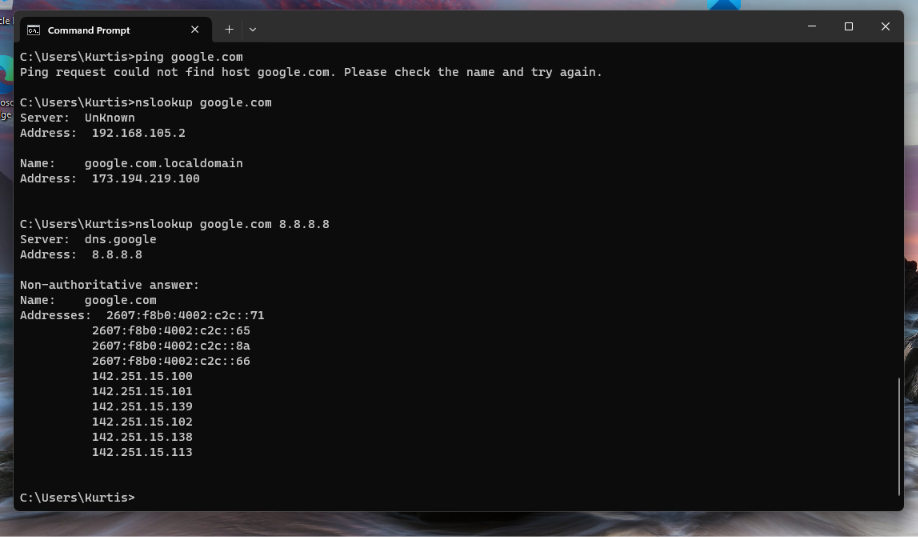
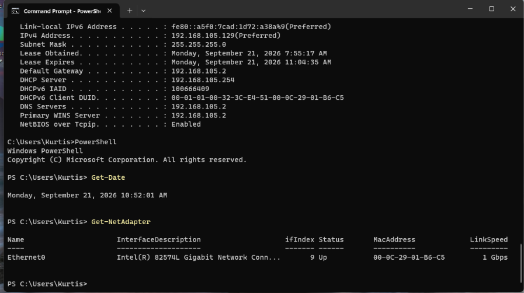
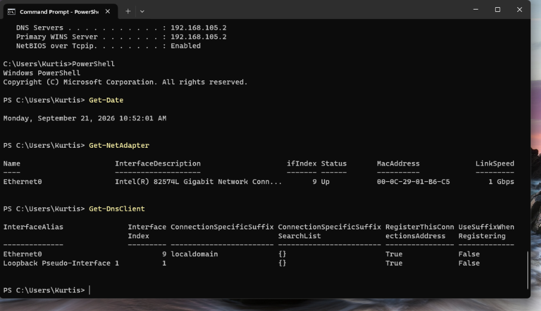
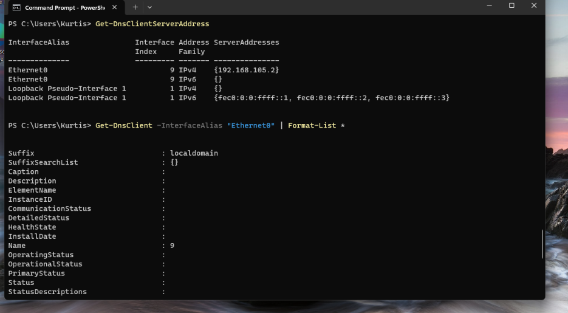
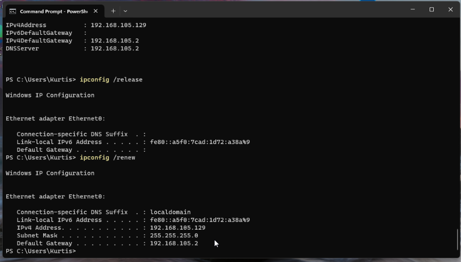
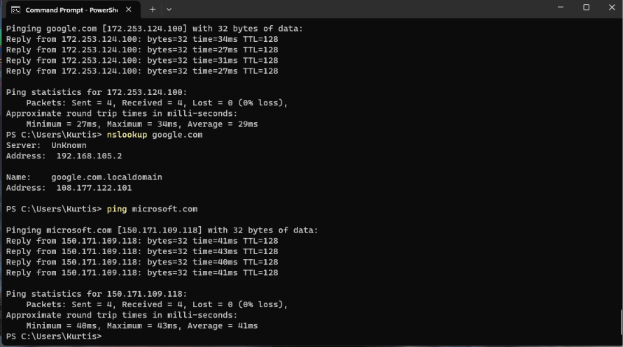

# INC-002 — Windows DNS Resolution Failure

## Incident Summary

While establishing a baseline configuration for a Windows 11 virtual machine, hostname resolution unexpectedly failed. The system could communicate with its local gateway and external IP addresses, but initially could not resolve standard domain names through normal Windows networking.

The issue was investigated using Windows Command Prompt, PowerShell, and VMware Workstation networking tools. A DHCP lease release and renewal restored normal hostname resolution and web access.

The exact underlying root cause was not conclusively identified.

---

## Environment

- **Client:** Windows 11
- **Hostname:** VM002-Windows
- **Virtualization:** VMware Workstation Pro
- **Network Mode:** NAT
- **VMware Network:** VMnet8
- **IPv4 Address:** 192.168.105.129
- **Subnet Mask:** 255.255.255.0
- **Default Gateway:** 192.168.105.2
- **DNS Server:** 192.168.105.2
- **DHCP Server:** 192.168.105.254
- **Connection-Specific DNS Suffix:** localdomain

---

## Reported / Observed Issue

During baseline network testing, the Windows 11 VM demonstrated successful local and external IP connectivity but failed to resolve a standard domain name.

The default gateway was reachable:

```text
ping 192.168.105.2
```

External IP connectivity was also successful:

```text
ping 8.8.8.8
```

However, attempting to reach Google by hostname failed:

```text
ping google.com
```

Windows returned:

```text
Ping request could not find host google.com.
Please check the name and try again.
```

Because direct IP connectivity worked while hostname resolution failed, the investigation shifted toward DNS and name-resolution behavior.



---

## Troubleshooting Process

### 1. Verified Windows Network Configuration

Initial configuration was reviewed with:

```text
ipconfig
ipconfig /all
```

The VM had received an IPv4 address through DHCP and had a valid-looking network configuration.

Relevant values included:

```text
IPv4 Address:                   192.168.105.129
Subnet Mask:                    255.255.255.0
Default Gateway:                192.168.105.2
DHCP Server:                    192.168.105.254
DNS Server:                     192.168.105.2
Connection-specific DNS Suffix: localdomain
```

This established the network baseline before further troubleshooting.



---

### 2. Verified Local Gateway Connectivity

The default gateway was tested:

```text
ping 192.168.105.2
```

**Result:** Successful, 0% packet loss.

This demonstrated that VM002 could communicate with its local gateway.

---

### 3. Verified External IP Connectivity

An external IP address was tested:

```text
ping 8.8.8.8
```

**Result:** Successful, 0% packet loss.

Because an external IP address was reachable, basic connectivity beyond the local VM network was functioning.

This also demonstrated an important troubleshooting distinction:

> Successful communication with an external IP address does not prove DNS is functioning.

---

### 4. Identified Hostname Resolution Failure

The following test was performed:

```text
ping google.com
```

**Result:** Failed.

Windows reported that it could not find the host.

At this point:

- Local gateway connectivity worked.
- External IP connectivity worked.
- Standard hostname resolution failed.

This narrowed the investigation toward DNS/name resolution rather than general network connectivity.

---

### 5. Tested the Configured DNS Server

The configured DNS server was queried directly:

```text
nslookup google.com
```

The DNS server at `192.168.105.2` responded, but the result displayed:

```text
Name:    google.com.localdomain
Address: 173.194.219.100
```

This demonstrated that the configured DNS server was reachable and responding, but the returned naming behavior warranted additional investigation.

---

### 6. Compared Against an External DNS Resolver

Google Public DNS was queried directly:

```text
nslookup google.com 8.8.8.8
```

This successfully returned multiple IPv4 and IPv6 addresses for:

```text
google.com
```

This A/B comparison demonstrated that external DNS resolution was available and provided another reference point for investigating the VM's normal resolution path.

---

### 7. Tested an Absolute Fully Qualified Domain Name

The same hostname was queried with a trailing period:

```text
nslookup google.com.
```

This successfully returned:

```text
google.com
```

The trailing period represents the DNS root and causes the name to be treated as an absolute fully qualified domain name (FQDN).

The same concept was tested using:

```text
ping google.com.
```

**Result:** Successful.

This provided additional evidence that DNS infrastructure was reachable while normal Windows hostname-resolution behavior was exhibiting an abnormal condition.

---

### 8. Investigated VMware Virtual Networking

VMware Virtual Network Editor was inspected to determine how VM002 received its network configuration.

VM002 was identified as using:

```text
VMnet8
Network Type: NAT
Subnet:       192.168.105.0/24
DHCP:         Enabled
```

VMware's DHCP pool was:

```text
192.168.105.128 - 192.168.105.254
```

VM002's address:

```text
192.168.105.129
```

fell within that DHCP range.

VMware NAT settings also identified:

```text
Gateway IP: 192.168.105.2
```

This matched both the default gateway and DNS server reported by Windows.

VMware's NAT DNS settings were configured to automatically detect available upstream DNS servers rather than using manually specified DNS addresses.

---

### 9. Investigated the Windows DNS Client with PowerShell

PowerShell was introduced to obtain more structured information about the Windows network configuration.

The network adapter was inspected with:

```powershell
Get-NetAdapter
```

Relevant results included:

```text
Name:           Ethernet0
InterfaceIndex: 9
Status:         Up
LinkSpeed:      1 Gbps
```

The Windows DNS client configuration was then inspected:

```powershell
Get-DnsClient
```

This confirmed that `localdomain` was a connection-specific suffix associated with Ethernet0.



The configured DNS server was confirmed with:

```powershell
Get-DnsClientServerAddress
```

Ethernet0 showed:

```text
InterfaceIndex: 9
AddressFamily:  IPv4
ServerAddresses: 192.168.105.2
```



A general network configuration view was obtained with:

```powershell
Get-NetIPConfiguration
```

Detailed DNS client properties were then inspected using a PowerShell pipeline:

```powershell
Get-DnsClient -InterfaceAlias "Ethernet0" | Format-List *
```

This confirmed:

```text
Hostname:                 VM002-Windows
ConnectionSpecificSuffix: localdomain
InterfaceAlias:           Ethernet0
InterfaceIndex:           9
```

The Windows host itself did not have a primary DNS suffix configured. The `localdomain` value was associated specifically with the Ethernet0 connection.

---

### 10. Refreshed the DHCP Lease

To test whether the network state was associated with the current DHCP configuration, the DHCP lease was released:

```text
ipconfig /release
```

After release:

- The DHCP-assigned IPv4 address disappeared.
- The default gateway disappeared.
- The `localdomain` connection-specific DNS suffix disappeared.

A new DHCP lease was then requested:

```text
ipconfig /renew
```

After renewal:

```text
IPv4 Address:                   192.168.105.129
Subnet Mask:                    255.255.255.0
Default Gateway:                192.168.105.2
Connection-specific DNS Suffix: localdomain
```

The return of `localdomain` after obtaining a fresh DHCP configuration demonstrated that the suffix was associated with the dynamically supplied network configuration.



---

### 11. Retested the Original Failure

After the DHCP release and renewal, the original test was repeated:

```text
ping google.com
```

**Result:** Successful.

The hostname resolved normally and returned successful ICMP replies with 0% packet loss.

Importantly, `localdomain` was still present.

This changed the working hypothesis: the presence of the `localdomain` suffix alone could not explain the original failure because normal hostname resolution now worked while the suffix remained configured.

---

### 12. Verified Resolution Against Multiple Domains

A second unrelated hostname was tested:

```text
ping microsoft.com
```

**Result:** Successful.

This demonstrated that restored hostname resolution was not limited to a single domain.

`nslookup google.com` continued to display `google.com.localdomain`, despite normal Windows hostname resolution functioning successfully.

This further demonstrated that the unusual `nslookup` output alone was not sufficient evidence of a DNS failure.



---

### 13. Verified User-Facing Web Connectivity

Microsoft Edge was used for final application-level verification.

The following websites loaded successfully:

- Google
- Microsoft

This confirmed that the original user-facing network functionality had been restored rather than relying solely on successful diagnostic commands.


---

## Resolution

Normal hostname resolution and web connectivity were restored after refreshing the Windows DHCP lease:

```text
ipconfig /release
ipconfig /renew
```

The `localdomain` connection-specific DNS suffix remained present after the issue was resolved.

Therefore, the presence of `localdomain` alone could not be identified as the root cause.

The exact underlying cause was not conclusively determined. The available evidence supports a transient issue involving the client's DHCP/network or name-resolution state that was cleared during the DHCP refresh.

No static DNS server or IP configuration was required to restore functionality.

---

## Verification

Post-resolution testing confirmed:

- Local gateway connectivity
- External IP connectivity
- Successful hostname resolution
- Successful resolution of multiple unrelated domains
- Successful ICMP communication with external hosts
- Successful web access through Microsoft Edge
- Continued connectivity after DHCP lease renewal

**Incident Status: Resolved**

---

## Commands Used

### Command Prompt / Windows Networking Utilities

```text
hostname
whoami
ipconfig
ipconfig /all
ping 192.168.105.2
ping 8.8.8.8
ping google.com
ping google.com.
ping microsoft.com
nslookup google.com
nslookup google.com 8.8.8.8
nslookup google.com.
ipconfig /release
ipconfig /renew
```

### PowerShell

```powershell
Get-Date
Get-NetAdapter
Get-DnsClient
Get-DnsClientServerAddress
Get-NetIPConfiguration
Get-DnsClient -InterfaceAlias "Ethernet0" | Format-List *
```

---

## Key Takeaways

- Verify local connectivity before troubleshooting external services.
- Successful IP connectivity does not prove DNS resolution is functioning.
- A DNS server responding does not necessarily prove the complete client name-resolution path is functioning normally.
- Use multiple diagnostic methods to isolate a fault rather than relying on a single command.
- Compare configured DNS behavior against a known external resolver when appropriate.
- DHCP release and renewal can clear some transient client network configuration issues.
- A configuration value that appears unusual is not automatically the root cause of a problem.
- Retest after every meaningful change because new evidence can invalidate an earlier hypothesis.
- Distinguish between correlation and proven causation.
- Verify the user's actual service after restoring connectivity, not only diagnostic commands.
- Do not claim a root cause unless the available evidence supports it.

---

## Skills Demonstrated

- Windows 11 network troubleshooting
- TCP/IP fundamentals
- DHCP troubleshooting
- DNS troubleshooting
- Windows Command Prompt
- Windows PowerShell
- PowerShell cmdlets and pipelines
- VMware Workstation virtual networking
- NAT and DHCP analysis
- DNS client configuration analysis
- Evidence-based fault isolation
- Hypothesis testing
- Post-resolution verification
- Technical incident documentation

---

## Final Status

**Resolved**

Normal DNS resolution and user-facing web connectivity were restored after refreshing the DHCP lease. Testing confirmed successful access to multiple external domains and websites.

The precise root cause was not conclusively identified, and no unsupported root-cause claim was made.
