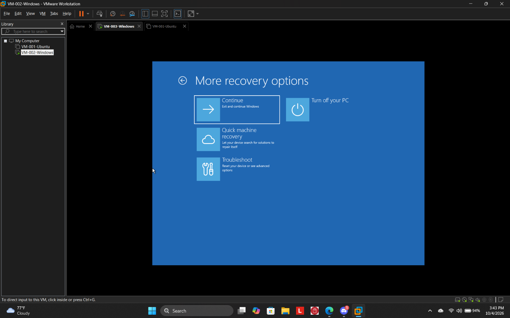
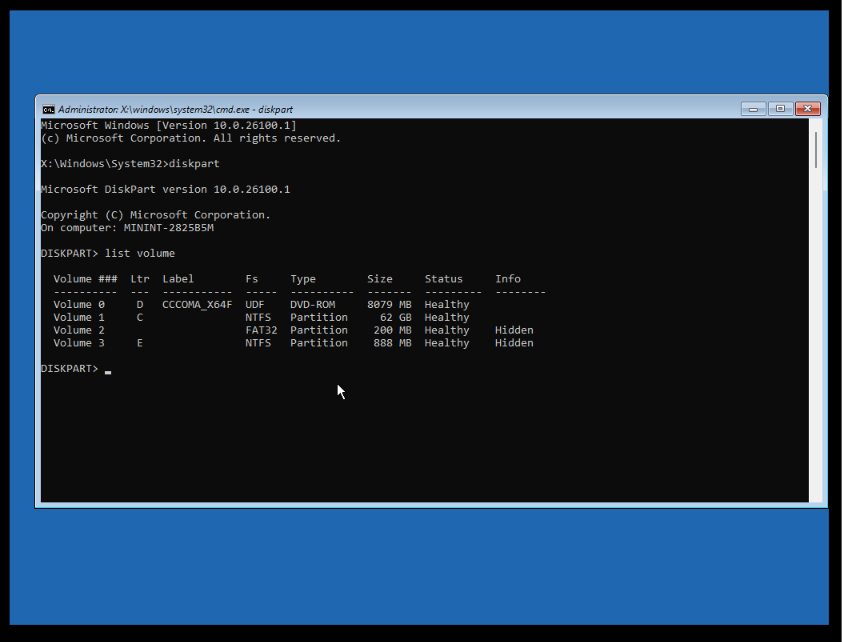
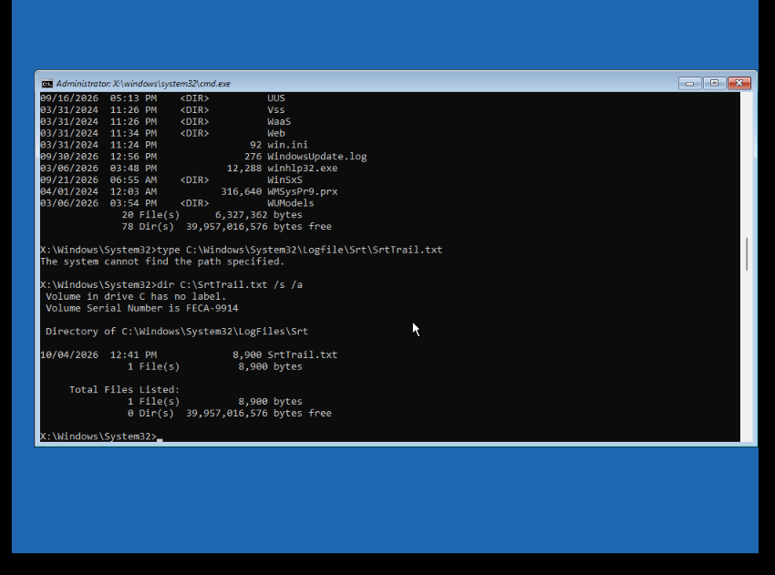
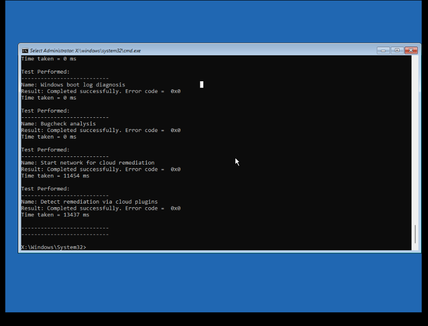
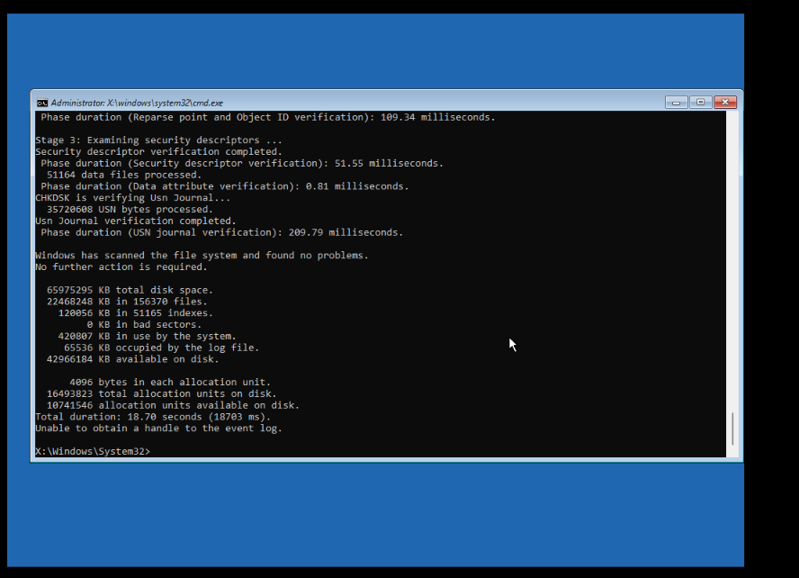
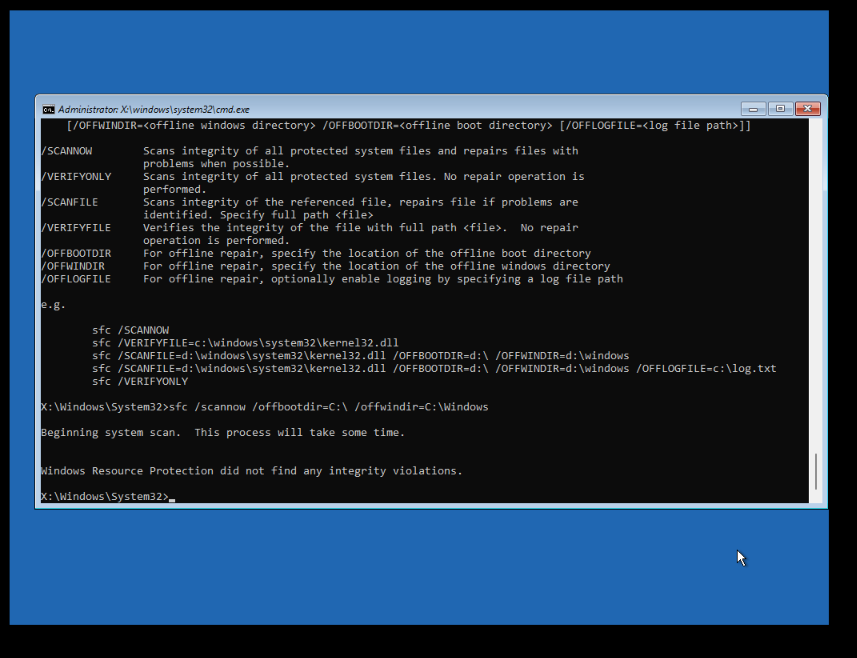
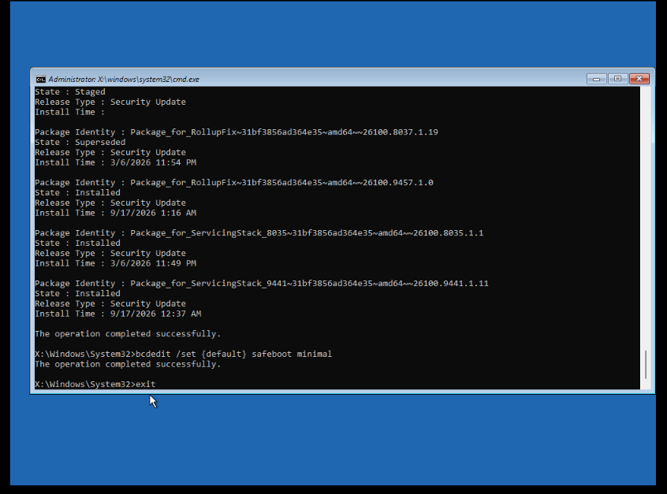
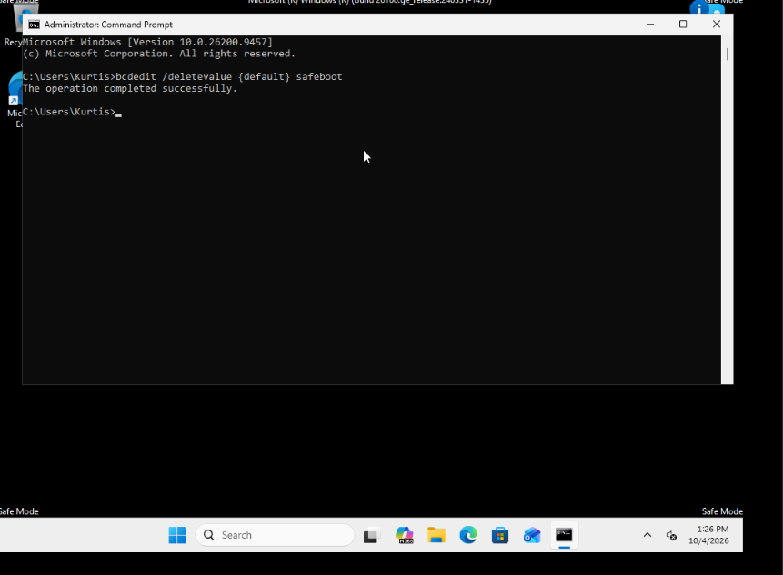
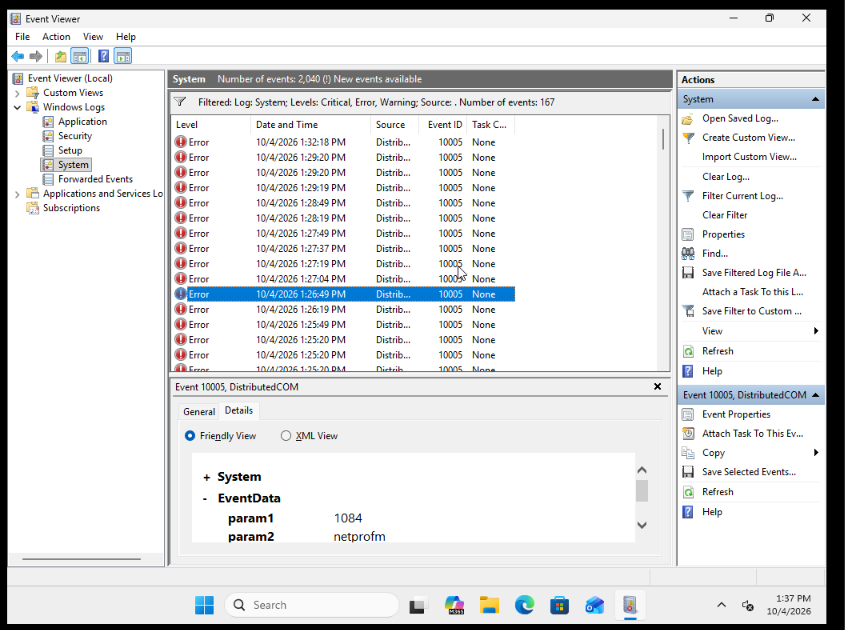

## Evidence

The following screenshots document the recovery process from the Windows Recovery Environment through successful restoration of normal Windows startup.

### 1. Windows Recovery Environment

Troubleshooting began from the Windows Recovery Environment after the Windows 11 virtual machine failed to boot normally.

### 2. Disk and Volume Identification

DiskPart was used to identify the available volumes and establish the location of the Windows installation, EFI/system partition, recovery environment, and installation media before making changes.

### 3. Startup Repair Log Location

The Windows Startup Repair diagnostic log, `SrtTrail.txt`, was located for further investigation.

### 4. Startup Repair Diagnostics

Startup Repair diagnostic results were reviewed. The automated tests did not establish a definitive root cause for the boot failure.

### 5. Filesystem Verification

CHKDSK was used to examine the Windows filesystem. The scan found no filesystem problems and reported zero bad sectors.

### 6. System File Integrity Verification

An offline System File Checker scan was performed against the Windows installation. Windows Resource Protection reported no integrity violations.

### 7. Servicing Investigation and Safe Mode Configuration

DISM was used during the investigation of Windows servicing and package state. BCDEdit was subsequently used to configure the system for a minimal Safe Mode boot as an isolation step.

### 8. Successful Safe Mode Boot

Windows successfully loaded in Safe Mode, demonstrating that the core operating system remained bootable with a reduced driver and service set. The forced Safe Mode configuration was then removed with BCDEdit.

### 9. Event Viewer Investigation

After access to Windows was restored, Event Viewer was reviewed for evidence that could explain the original startup failure. Events generated by the reduced Safe Mode environment were evaluated in context rather than automatically treated as the root cause.

### 10. Normal Boot Verification

The virtual machine successfully returned to the normal Windows desktop after the Safe Mode configuration was removed. Normal startup was tested again to verify that recovery was repeatable.

---

## Incident Outcome

| Field | Result |
|---|---|
| **Status** | Resolved |
| **Affected System** | Windows 11 VMware virtual machine |
| **Initial Condition** | Automatic Repair / normal startup failure |
| **Recovery Method** | WinRE diagnostics followed by Safe Mode isolation and return to normal boot |
| **Filesystem Integrity** | No confirmed corruption |
| **System File Integrity** | No integrity violations identified |
| **Root Cause** | Undetermined |
| **Verification** | Two successful normal boots after recovery |

---

## Key Takeaway

**Recovery does not automatically prove causation.**

The goal of troubleshooting is not to force every incident into a convenient explanation. The goal is to follow the evidence, restore functionality safely, verify the result, and document only what the available evidence can support.
