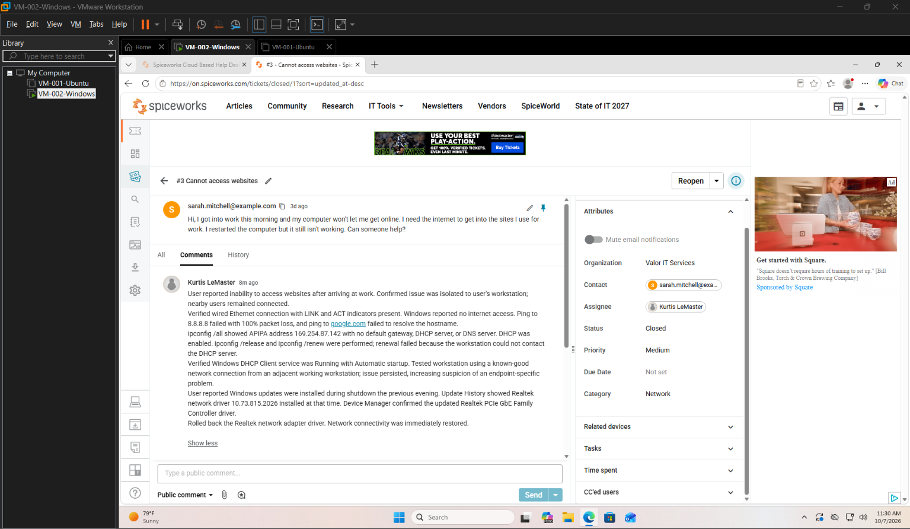
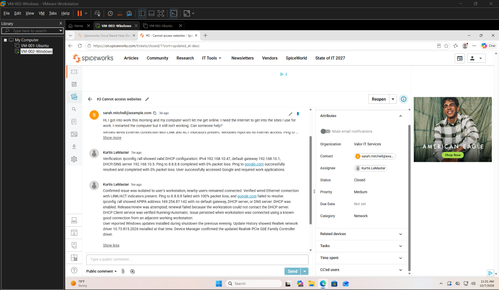
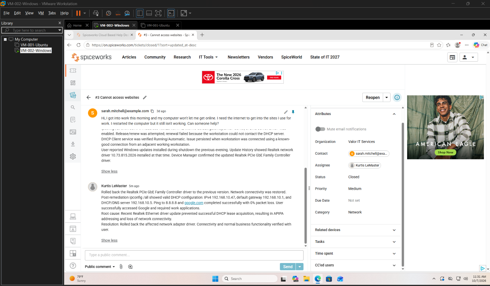
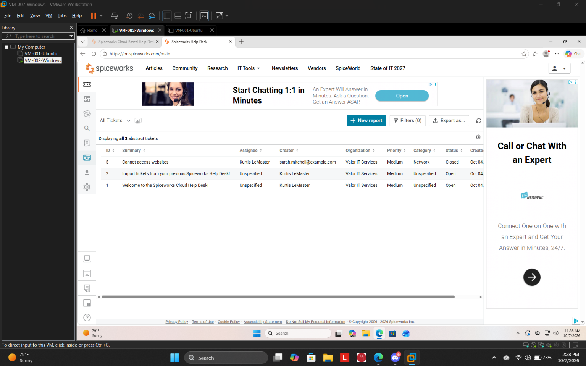

# INC-004 — DHCP Failure After Network Driver Update

## Overview

This lab documents a simulated help desk incident managed through Spiceworks Cloud Help Desk in my Windows 11 VMware homelab.

A user reported that their workstation could no longer access websites or required web-based work applications. The incident was investigated from initial user intake through troubleshooting, remediation, verification, documentation, and ticket closure.

The investigation identified a recently installed Realtek Ethernet driver update as the cause of failed DHCP lease acquisition. Rolling back the affected driver restored network connectivity.

> **Note:** This is a simulated help desk incident created for hands-on training and portfolio development. No production systems or real end-user accounts were involved.

---

## Environment

- Windows 11 client workstation
- VMware Workstation
- Wired Ethernet connection
- DHCP-configured IPv4 networking
- Spiceworks Cloud Help Desk
- Windows Command Prompt
- Windows Services
- Device Manager
- Windows Update History

---

## Initial User Report

The user reported arriving at work and being unable to access websites required for normal job duties.

The user had already restarted the workstation before contacting support.

Nearby coworkers were able to access the internet and the same web resources successfully, indicating that the issue was likely isolated to the affected workstation.

**Initial ticket classification:**

- Priority: Medium
- Category: Other
- Status: Open

The ticket was later reclassified as **Network** after troubleshooting established the nature of the incident.

---

## Information Gathering

Initial troubleshooting established the following:

- The issue affected one workstation.
- Nearby users remained operational.
- The workstation normally used wired Ethernet.
- The Ethernet LINK indicator was solid.
- The ACT indicator was blinking.
- Windows displayed "No internet access."
- The user could not access normal websites.

The physical link indicators suggested that the workstation had an active Ethernet connection, but this did not confirm valid IP configuration or network-layer connectivity.

---

## Connectivity Testing

External IP connectivity was tested:

```cmd
ping 8.8.8.8
```

Result:

```text
Packets: Sent = 4, Received = 0, Lost = 4 (100% loss)
```

DNS/name resolution was then tested:

```cmd
ping google.com
```

Windows returned:

```text
Ping request could not find host google.com.
Please check the name and try again.
```

At this stage, both external IP connectivity and hostname resolution were unavailable.

---

## IP Configuration Investigation

The workstation's network configuration was examined:

```cmd
ipconfig /all
```

Relevant results included:

```text
DHCP Enabled:                    Yes
Autoconfiguration IPv4 Address: 169.254.87.142
Subnet Mask:                     255.255.0.0
Default Gateway:                 [blank]
DHCP Server:                     [blank]
DNS Servers:                     [blank]
```

The `169.254.x.x` address identified the configuration as **APIPA (Automatic Private IP Addressing)**.

This indicated that Windows was configured to use DHCP but had failed to obtain a valid DHCP lease.

---

## DHCP Troubleshooting

A DHCP lease refresh was attempted:

```cmd
ipconfig /release
ipconfig /renew
```

The renewal failed with:

```text
Unable to contact your DHCP server.
Request has timed out.
```

The Windows **DHCP Client** service was then inspected.

Results:

- Status: Running
- Startup Type: Automatic

This eliminated a stopped or disabled DHCP Client service as the immediate cause.

---

## Isolation Testing

The workstation was connected using a known-good Ethernet connection from an adjacent workstation that had confirmed network connectivity.

The affected workstation continued to report no internet access.

Because the problem persisted when using a known-good network connection, suspicion shifted away from the original cable/network path and toward the affected endpoint.

---

## Change Investigation

The user was asked whether anything had changed before the problem began.

The user reported selecting **Update and shut down** the previous evening and stated that the network problem appeared the following morning.

Windows Update History was inspected.

A recent network driver update was identified:

```text
Realtek – Net – 10.73.815.2026
```

Device Manager confirmed that the **Realtek PCIe GbE Family Controller** was using the newly installed driver.

This created a strong correlation between the network driver change and the beginning of the connectivity failure.

---

## Remediation

The Realtek Ethernet adapter driver was rolled back through Device Manager to the previously installed version.

After the rollback, Windows immediately restored network connectivity.

---

## Verification

Network configuration was checked again:

```cmd
ipconfig /all
```

The workstation now received valid DHCP configuration:

```text
IPv4 Address:    192.168.10.47
Subnet Mask:     255.255.255.0
Default Gateway: 192.168.10.1
DHCP Server:     192.168.10.5
DNS Server:      192.168.10.5
```

External IP connectivity was verified:

```cmd
ping 8.8.8.8
```

Result:

```text
Packets: Sent = 4, Received = 4, Lost = 0 (0% loss)
```

DNS resolution and connectivity were then verified:

```cmd
ping google.com
```

The hostname resolved successfully and all four replies were received with 0% packet loss.

Finally, the user successfully accessed:

- Google
- Employee web portal
- Required web-based work application

Normal business functionality was confirmed before ticket closure.

---

## Root Cause

A recently installed Realtek Ethernet adapter driver caused the workstation to fail successful DHCP lease acquisition.

Without a DHCP lease, Windows assigned an APIPA address (`169.254.87.142`) and the workstation had no default gateway or DNS configuration.

---

## Resolution

The affected Realtek network adapter driver was rolled back to the previous version.

Following rollback:

- DHCP functionality returned.
- A valid IPv4 lease was obtained.
- Default gateway and DNS configuration were restored.
- External IP connectivity succeeded.
- DNS resolution succeeded.
- Required user applications were accessible.

The incident was documented and the Spiceworks ticket was closed.

---

## Lessons Learned

This incident reinforced the importance of troubleshooting from evidence rather than assuming that a reported "internet problem" is automatically a DNS, cable, or infrastructure problem.

One improvement identified during the lab was the value of asking early in the troubleshooting process:

> **When did the problem last work normally, and what changed since then?**

Asking this earlier could have identified the recent network driver update sooner.

The incident also demonstrated that physical Ethernet LINK/ACT indicators do not guarantee valid Layer 3 network configuration. The workstation maintained physical link while DHCP negotiation was failing.

Testing with a known-good connection also helped isolate the problem to the endpoint before making more invasive network changes.

---

## Skills Demonstrated

- Help desk ticket lifecycle management
- End-user information gathering
- Incident triage
- Incident documentation
- Windows 11 troubleshooting
- TCP/IP troubleshooting
- DHCP troubleshooting
- APIPA identification
- Connectivity testing
- DNS resolution testing
- Windows Services administration
- Device Manager troubleshooting
- Driver rollback
- Change correlation
- Known-good substitution testing
- Root cause analysis
- Post-remediation verification
- Professional end-user communication

---

# Evidence

The following screenshots document the simulated incident from ticket intake through troubleshooting, verification, resolution, and closure.

## 1. Ticket Intake and Troubleshooting

The original user report and technician documentation show the initial scope, failed connectivity testing, APIPA identification, DHCP troubleshooting, known-good connection testing, and discovery of the recent Realtek network driver update.



---

## 2. Post-Remediation Verification

After rolling back the affected network adapter driver, DHCP configuration, external IP connectivity, DNS resolution, and access to required work applications were verified.



---

## 3. Root Cause and Resolution

The final technician documentation records the driver rollback, restored DHCP functionality, successful connectivity testing, identified root cause, and confirmed resolution.



---

## 4. Closed Ticket

The completed Spiceworks ticket was classified as a **Network** incident with **Medium** priority and closed after successful user verification.



---

# Incident Outcome

| Field | Result |
|---|---|
| **Status** | Resolved and Closed |
| **Category** | Network |
| **Priority** | Medium |
| **Affected Users** | One |
| **Root Cause** | Realtek Ethernet driver update prevented successful DHCP lease acquisition |
| **Remediation** | Rolled back the affected network adapter driver |
| **Verification** | Valid DHCP lease restored, external IP connectivity confirmed, DNS resolution confirmed, and required user applications successfully tested |

---

## Troubleshooting Workflow

```text
User reports no internet
        ↓
Determine scope
        ↓
Single workstation affected
        ↓
Verify physical Ethernet link
        ↓
Test external IP connectivity
        ↓
FAILED
        ↓
Test DNS resolution
        ↓
FAILED
        ↓
Inspect IP configuration
        ↓
169.254.x.x APIPA address
        ↓
Attempt DHCP release/renew
        ↓
DHCP renewal FAILED
        ↓
Verify DHCP Client service
        ↓
Running / Automatic
        ↓
Test known-good network connection
        ↓
Problem persists
        ↓
Shift investigation to endpoint
        ↓
Ask "What changed?"
        ↓
Recent Realtek network driver update identified
        ↓
Rollback network adapter driver
        ↓
DHCP lease restored
        ↓
Verify IP connectivity
        ↓
Verify DNS resolution
        ↓
Verify user applications
        ↓
RESOLVED
```

---

## Key Takeaway

This incident demonstrated that successful troubleshooting is not simply a matter of knowing commands. Each test should answer a specific question and either strengthen or eliminate a hypothesis.

The troubleshooting process progressively narrowed the problem from a broad report of "no internet" to a specific endpoint driver failure by combining user questioning, network-layer testing, known-good substitution, change investigation, remediation, and verification.
